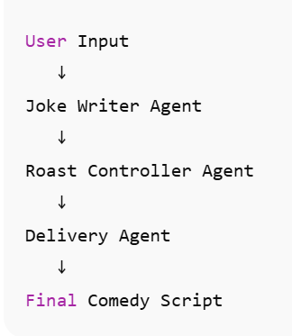

# 🔥 Agentic Comedy Factory

**Agentic Comedy Factory** is a humorous AI-powered stand-up comedy generator built with **Agentic AI architecture**. It uses multiple agents to generate personalized roast jokes and deliver them as punchy, meme-worthy comedy scripts.  

---

## ⚡ Features

- **Personalized Roast Jokes** – Customize with a person’s name, traits, and roast level.  
- **Agentic AI Workflow** – Modular design using agents (nodes + graph + conditional edges).  
- **Clean Comedy Scripts** – Single-sentence jokes, English only, meme-ready.  
- **Multiple Roast Levels** – Light, medium, savage.  
- **Easy Streamlit Interface** – Enter inputs and get the final comedy script instantly.

---

## 🛠 Setup

1. **Clone the repository**

```bash
git clone https://github.com/yourusername/agentic_comedy_factory.git
cd agentic_comedy_factory

Create and activate a virtual environment

python -m venv venv
# Windows
venv\Scripts\activate
# macOS/Linux
source venv/bin/activate


Install dependencies

pip install -r requirements.txt


Set up your .env

# Example .env
GROQ_API_KEY=your_groq_api_key
HF_TOKEN=your_huggingface_token
HF_SD_MODEL=stabilityai/stable-diffusion-xl-base-1.0

🚀 Usage

Run the Streamlit app:
streamlit run app.py
Enter Person Name, Traits, and Roast Level.
Click Generate.
The app outputs a polished, ready-to-perform comedy script.

🧠 Agents Overview
Agent	                Function
joke_writer.py	      Generates roast jokes based on input name, traits, and roast level.
roast_controller.py	  Adjusts intensity of the jokes (light, medium, savage).
delivery_agent.py	    Combines jokes into a polished script ready for delivery.

🔧 Utils
llm.py – Helper for calling LLMs via GROQ or HuggingFace. Handles prompt formatting, temperature, and outputs clean responses.

🎯 Workflow

User enters inputs in Streamlit frontend.
Joke Writer Agent generates jokes.
Roast Controller Agent modifies tone based on selected roast level.
Delivery Agent compiles the final script in a polished format.
Script is displayed in the app.

💡 Tips for Best Results

Use concise, descriptive traits for the person to generate funnier jokes.
Roast level savage gives aggressive humor, light gives mild roast.
Only English jokes are supported currently — better meme readability.

⚠️ Notes

Make sure your GROQ_API_KEY is valid.
Check model availability on GROQ dashboard if errors occur (llama3-8b may be deprecated).
Streamlit requires a stable internet connection to fetch LLM responses.

📦 requirements.txt
streamlit>=1.26.0
requests>=2.31.0
python-dotenv>=1.0.0
langgraph>=0.0.40
langchain-core>=0.1.46


Note: Adjust langgraph and langchain-core versions if you hit dependency conflicts. Always check the latest compatible versions in the official docs.

## Workflow
The workflow of the project is illustrated below:


